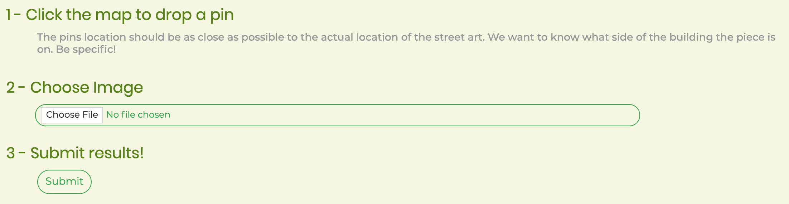

# sKreet Art
## Created by Sturdy-Guac

sKreet Art is an attempt at cataloging the forgotten art around the city of Richmond, VA.  
We give you an **informative photo gallery** and an **interactive map** allowing you to explore the depths of this richly adorned, luscious metropolitan.  
Of course we don't condone any illegal activities, but we do like art!  

#### Help us expand! Add your (or someone else's) street art to our database!

## How To
#### Upload a picture and add it to the map

- On the map, click to add a marker at the location of the found piece
  - try to be **as close as possible!** 
  - you can reselect a marker if pick the wrong spot
 - Select "Choose File" to navigate to the picture you would like to submit
 - Select "Upload" to add your photo to the database!
 
 
 
 
 ## View All
 #### Display all markers in the database, and click on a marker to show piece at that location

 
 
 #### Alternatively, if you just want to see the pictures, you can find them on our gallery
 
 
